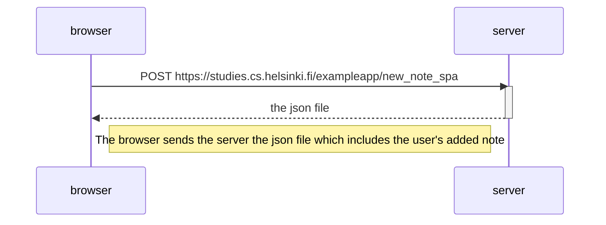

```mermaid
sequenceDiagram
  participant browser
  participant server

  browser->>server: POST https://studies.cs.helsinki.fi/exampleapp/new_note_spa
  activate server
  server-->>browser: the json file
  deactivate server

  Note right of browser: The browser sends the server the json file which includes the user's added note
  
```
